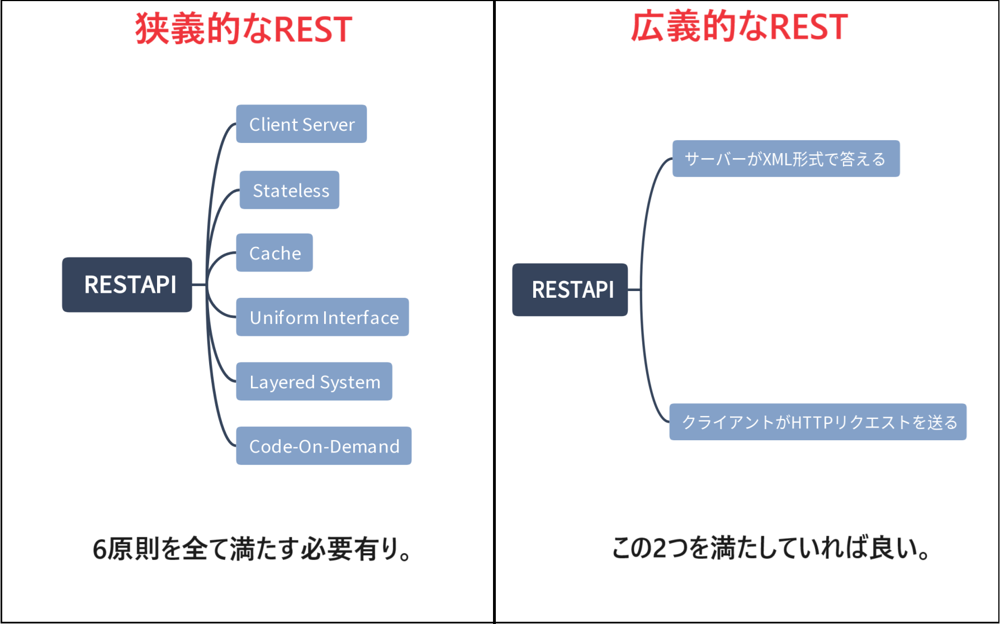
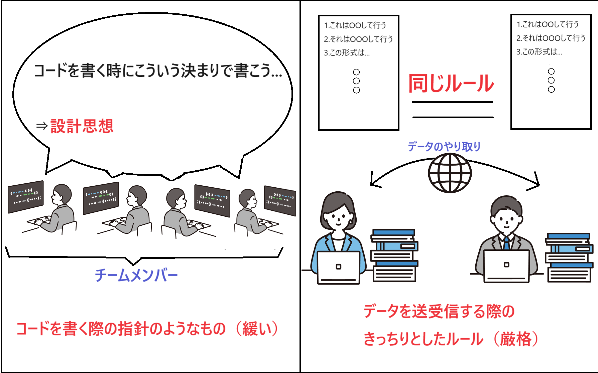

# APIとWebAPIの違いって？
## API
- API OSやアプリケーションソフトが提供するもので、基本的に同一言語で書かれたプログラムしか連携できないという特徴があります。そのため自分が作りたいアプリケーションに必要な機能を自分が開発すること無く、APIを用いることで誰かが開発した既存のサービスを利用するといった使い方をする事が多いです。

## WebAPI 
APIに対し、
  - 基本的にhttps上で動作するため、異なるプログラミング言語によって作られたアプリケーションを連携する事ができる
  - webブラウザでも利用が可能（例えば、\*Instagram\*等のSNSがPCのブラウザ上から閲覧したり、投稿が可能なのもWebapiのお陰です）
  
という特徴があります。SNSに用いられている事からapiよりもWebapiの方が身近に感じやすく、非プログラマーにも馴染みがあると言えるでしょう。
## WebAPIの種類
### 1.XML over HTTP
\*XML over HTTP\*は、データをやり取りするための手段として使われる通信プロトコル*です。XML（eXtensible Markup Language）は情報を整理して表現するための言語で、これをHTTP（Hypertext Transfer Protocol）を使ってウェブ上でやり取りします。HTTPは、Web上でデータを転送するための規格であり、これを利用する事によりXMLデータを送受信します。\*XML over HTTP\*は、\*\*異なるシステムやプラットフォーム間でデータをやり取りするための汎用的な手段\*\*として広く利用されています。以下は、主な特徴です。

- データ交換フォーマットとしてのXML

     XMLはマークアップ言語であり、データを整理して表現するために使用されます。XMLを使用することで、異なるプログラミング言語やプラットフォーム間でデータを共有できます。

- HTTPプロトコルを介した通信 

    \*XML over HTTP\*は、HTTPプロトコルを基盤にしていて、クライアントとサーバーはHTTPリクエストとレスポンスを使用する事でXMLデータを送受信しています。クライアントがHTTPリクエストを送り、サーバーがその要求にXML形式で答える仕組みとなっています。
- Webサービスとの結びつき

    \*XML over HTTP\*は、HTTP経由でXMLの形式で書かれたデータを送受信し、異なるプラットフォームやアプリケーション間でデータを共有するためにWebサービスなどに利用されています。

    *プロトコルとは、コンピュータ間の通信に関するルールで、通信を行うコンピュータ同士が\*\*同じプロトコルを使わないとデータをやり取り\*\*できません。
### 2.JSON over HTTP
\*JSON over HTTP\*は、JSON（JavaScript Object Notation）を使用してデータをやり取りするための通信プロトコルです。\*JSON over HTTP\*は前項と同様に、HTTPを利用してJSONデータを送受信します。以下に\*JSON over HTTP\*の主な特徴や用途について解説します。

- データ交換フォーマットとしてのJSON

    JSONは軽量で読みやすいデータ交換フォーマットであり、\*JavaScript\*オブジェクトの表現方法に基づいています。XMLと同様にJSONを使用することで、異なるプログラミング言語やプラットフォーム間でデータを簡単に共有できます。
- HTTPプロトコルを介した通信

    \*JSON over HTTP\*は、XMLと同様にHTTPプロトコルを基盤にしています。XMLとは、クライアントが送信した\*\*HTTPリクエスト\*\*に対し、\*\*JSON形式のレスポンス\*\*を返すという違いがあります。
- RESTful Webサービス

    JSON over HTTPは、XMLを使用する\*XML over HTTP\*と比べ柔軟性に優れているのもあり、RESTful Webサービスとの相性が非常に良いです。RESTfulサービスは、通常はJSONなどの軽量なデータフォーマットを使用してデータを交換します。HTTPメソッド（GET、POST、PUT、DELETE等）を使用して、リソースに対する操作を表現します。RESTfulについては、次項で解説します。

\*\*多くのWebAPIはJSON over HTTPを使用してデータを提供\*\*します。クライアントがHTTPリクエストを送り、サーバーがJSON形式のデータを含むレスポンスを返すことで、アプリケーションやサービスが連携できます。
JSON over HTTPは、そのシンプルさと柔軟性から広く利用され、Web開発やAPI統合などさまざまな領域で重要な役割を果たしています。
### 3.RESTAPI
RESTは、\*Representational State Transfer\*の略です。
ロイ・フィールディングの論文[1]を元にした、6つの項目をすべて満たす通信インターフェイスを設計するためのアーキテクチャスタイル（設計思想）の事を言います。（以下は論文中に記されている6項目）
- \*Client Server\*（送信者と受信者の独立）
- \*Stateless\*（以前のリクエストとは関係なく、新しいリクエストを処理する）
- \*Cache\*（全ての API レスポンスはキャッシュ可能である）
- \*Uniform Interface\*（統一された標準形式でデータを返す）
- \*Layered System\*（階層システム）
- \*Code-On-Demand\*（API レスポンスに、必要に応じてよく使うコードのショートカットを作成することができる）
RESTは、AmazonのECSなどが用いている広義的な定義に従えば、\*XML over HTTP\*の項で紹介したHTTPとXMLを利用してリソースの操作を行うという単純なくくりに分類されます。

\*\*ロイ氏の示した定義に従う狭義的なREST\*\*に対し、\*\*6原則で示されるRESTには含まれないざっくりとした範囲のAPI\*\*をRESTと呼ぶかどうかに関しては、議論が分かれるところではあります。ただ、\*\*実際にRESTとして公開されているAPIの中にはこうしたものも多く存在\*\*します。

#### 3.a RESTのメリット
REST はメッセージサイズが小さいため、高速で効率的に処理できます。RESTは XML,JSON,プレーンテキスト,HTML をサポートしていて、\*JSON over HTTP\*の項で記述した通り一般的にはJSONが使われています。また応答をキャッシュできる為、データをキャッシュに保存してページの読み込み時間を短縮することで作業効率の向上が見込めます。RESTは幅広く使える柔軟性が好まれ、広く普及しています。
#### 3.b RESTのデメリット
RESTにはプロトコルの規定があり、https上でしか動作しません。またRESTは設計思想の一つであり*、厳格な規定が存在しない為、\*\*人によって記述方法が異なる\*\*というケースが生じてしまい、中身が分かりにくくなってしまうというデメリットがあります。

---
[1]https://ics.uci.edu/~fielding/pubs/dissertation/top.htm

*この思想を満たす事をRESTfulであると言い、次項で説明するSOAPとは異なりRESTは思想の事なので、\*RESTful\*であるかどうかはプログラマに委ねられています。
### 4.SOAPAPI
SOAPは\*Simple Object Access Protocol\*の略です。
設計思想であるRESTに対してSOAPは厳格な通信ルールを定義するプロトコルで、アプリケーション間の通信用に使われるプロトコルです。主に企業間のシステム連携や、チーム内で使用するアプリ間の通信のためのインターフェースなどに用いられて来ました。SOAP はプロトコルであるため独立しており、httpsを含むどのトランスポートプロトコルでも動作するというメリットがあります。しかし、非常に複雑かつ、負荷が高いためあまり普及しませんでした（因みに、SOAPの次に使われるようになったのが前項で説明したRESTです。）。

プロトコルであるSOAPと設計思想であるRESTを比較しているサイトが数多くありますが、下の図のようにプロトコルと設計思想は根本的に異なるので、比べるのは少し違和感を覚えます。

