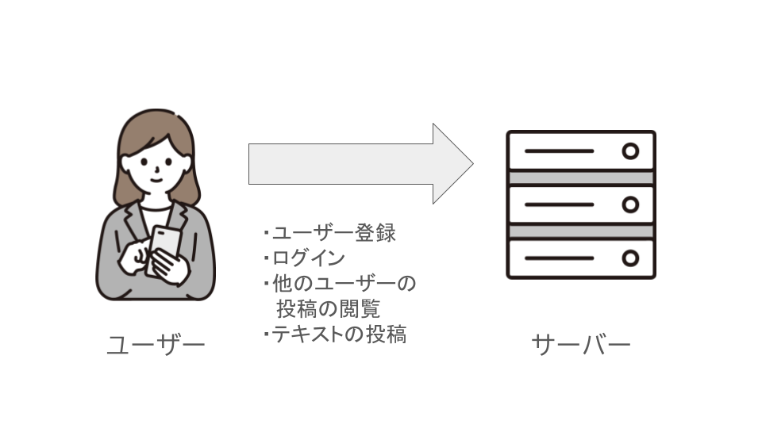

# APIってなんだろう

APIという単語を聞いたことはありますか？
API(Application Programming Interface)は、公開されているアプリとプログラムをつなぐ仲介役です。

この説明だとわかりにくいですね。例を出しましょう。ここでとあるSNSアプリがあるとします。
このSNSはユーザーがスマートフォンから他のユーザーの投稿を閲覧したり、自分がテキストを投稿することができます。
このアプリは、全ての処理がスマートフォンで完結しているわけではありません。
複数のデバイスから投稿されたデータを保存している、**サーバー**という場所で投稿は管理されています。
スマホに入っているアプリは、ここに対して投稿をアップロードしています。
加えてユーザーの情報などもサーバーが持っており、サーバーがそのサービスの本体といっても差し支えないでしょう。

私たちはユーザーを登録したり、ログインを行ったりといったことをしますが、これらはスマホのアプリがサーバーに**要求**を行っています。
ユーザーを登録してください、ログインしてください、といったものです。要求について詳しくは[*HTTPとは？*](../what-is-http/index.html)を参照してください。

この要求はそのスマホアプリからしか送信するときに、実はサーバーが公開している**API**にアクセスしています。
また、このAPIは公開されている場合があります。つまり、誰でもそのサーバーに対して特定の要求を送ることで、そのSNSで投稿をしたり、他の人の投稿一覧を取得したりできるのです。

だから例えばその投稿用のAPIを利用して、自動的に投稿するBOTのようなものを作成したり、他の人の投稿を取得して解析するといったことができるのです。

